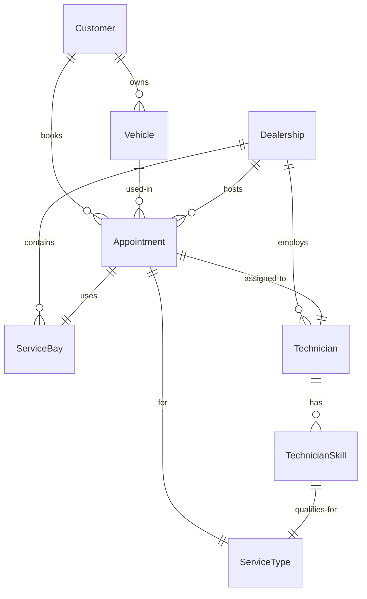

# Service Appointment Scheduler

A resource-constrained appointment scheduler for vehicle service dealerships.
A customer requests an appointment for a specific **vehicle**, **service type**,
and **dealership** at a desired time; the system atomically confirms it only if
both a free **service bay** and a **qualified technician** are available for the
entire service duration, then persists a confirmed **Appointment** record.

Built with **Ruby on Rails 8** and **PostgreSQL**.

## Core design — how double-booking is prevented

This is the crux of the application. Two layers guarantee that a service bay
and a technician can never be double-booked:

1. **Database level (definitive).** The `appointments` table has a generated
   `during tsrange` column derived from `starts_at`/`ends_at`, and two `EXCLUDE
   USING gist` constraints:

   ```sql
   EXCLUDE USING gist (service_bay_id WITH =, during WITH &&) WHERE (cancelled_at IS NULL)
   EXCLUDE USING gist (technician_id  WITH =, during WITH &&) WHERE (cancelled_at IS NULL)
   ```

   Postgres physically rejects any INSERT that overlaps an existing appointment
   for the same bay (or technician). Partial on `cancelled_at IS NULL` so a
   cancelled appointment frees its slot. Requires the `btree_gist` extension
   (enabled in the migration).

2. **Application level (friendly UX).** [`BookingService`](app/services/booking_service.rb)
   runs in a `SERIALIZABLE` transaction, locks candidate bays/technicians with
   `SELECT ... FOR UPDATE`, and only assigns a bay/tech that is free for the
   whole window *and* (for technicians) qualified for the requested service type
   via `technician_skills`. On a conflict it raises a typed
   `BookingService::NotAvailable` with a human message rather than a 500.

## Domain model



- **Appointment** ties together customer, vehicle, dealership, service type,
  the allocated technician and service bay, plus `starts_at`/`ends_at`/`status`.
- **TechnicianSkill** is the qualification join (a technician is only assignable
  to a service type they have a skill row for).
- **ServiceType.duration_minutes** drives the appointment window (`ends_at`).

## Requirements covered

| Requirement | Where |
|-------------|-------|
| Request an appointment for a vehicle, service type, dealership, time | `AppointmentsController#create` → `BookingService.book!` |
| Real-time availability check (free bay **and** qualified free tech, whole duration) | `BookingService.check_availability` + `/appointments/check_availability` |
| Persistent confirmed record linking customer, vehicle, technician, bay | `Appointment` record created in the `SERIALIZABLE` transaction |

## Getting started

```bash
bin/setup           # install gems, create & migrate DBs, seed
bin/dev             # start the server (http://localhost:3000)
```

Requires Ruby 4.0+ and PostgreSQL 13+. The seed data creates one dealership,
3 bays, 4 technicians (with varied qualifications), 4 service types, and a
sample customer + vehicle, so the app is usable immediately.

## Using it

1. Visit **/appointments/new** (the "Book" link).
2. Pick a dealership, service type, date, and time → **Check availability**.
3. Select the customer and vehicle → **Confirm appointment**.
4. The confirmation page shows the allocated technician and bay.

Browse dealerships (`/dealerships`), service types (`/service_types`), and
customers (`/customers`) from the top nav. Add customers/vehicles from their
pages.

## Testing

```bash
bundle exec rspec
```

The suite (89 examples) covers model validations/associations, the overlap
scopes, the database `EXCLUDE` constraints directly, the `BookingService`
happy paths and every failure mode (no bay, no qualified tech, double-booking,
qualification filtering, input validation), and the request flow including the
JSON availability endpoint. [Bullet](https://github.com/flyerhzm/bullet) fails
any request spec that triggers an N+1.

## Key files

- `app/services/booking_service.rb` — the race-safe allocation core
- `app/models/appointment.rb` — enum, validations, overlap scopes
- `db/migrate/*_create_appointments.rb` — `EXCLUDE` constraints + `during` range
- `spec/services/booking_service_spec.rb` — the booking logic tests
