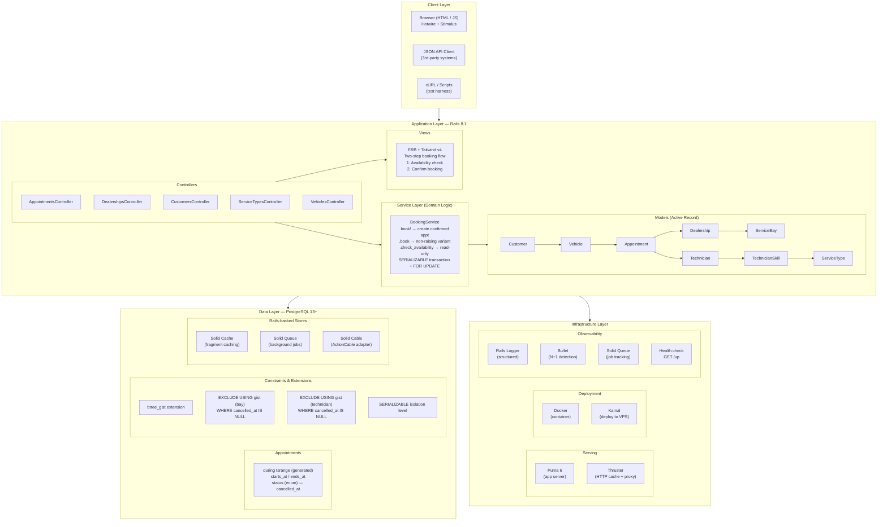

# System Design: Unified Service Scheduler

## Architecture Overview



The architecture follows a **layered design** with four tiers: Client, Application, Data, and Infrastructure. Each layer has a single responsibility and communicates only with the layer below it.

## Component Roles

### Client Layer

| Component | Role |
|-----------|------|
| **Browser (Hotwire + Stimulus)** | Renders the full web UI. Turbo Drive provides SPA-like navigation without JavaScript frameworks; Turbo Frames deliver partial page updates. Stimulus adds lightweight JS for the two-step booking form (customer → vehicle dropdown, availability check). |
| **JSON API** | `GET /appointments/check_availability.json` exposes availability data to external consumers. Returns structured JSON with bay/technician counts |
| **cURL / Test Harness** | Represents the "mock frontend" — the test suite (RSpec request specs) exercises every endpoint with HTTP-level assertions |

### Application Layer

| Component | Role |
|-----------|------|
| **Controllers** | Thin HTTP interface: parse params, delegate to service objects, set view variables. Never contain domain logic. `AppointmentsController` orchestrates the two-step booking flow. |
| **BookingService** | **The core of the system.** A stateless service object that encapsulates all resource-constrained booking logic. Two public methods: `.book!` (raises on failure) and `.book` (returns a Result struct). Handles transaction isolation, resource locking, and qualification verification. |
| **Models** | Active Record ORM layer. `Appointment` is the central model with status enum, `overlapping` scope using the tsrange column, and `busy_bay_ids`/`busy_technician_ids` convenience methods. `TechnicianSkill` is the join table linking technicians to their qualified service types. |
| **Views** | ERB templates styled with Tailwind CSS v4. Use a shared component pattern (`_page_header`, `_flash`, `_empty_state`) for consistency. The `new` view implements the two-step flow: availability search first, customer/vehicle selection second. |

### Data Layer

| Component | Role |
|-----------|------|
| **PostgreSQL** | Primary data store. Uses advanced features: `btree_gist` extension for exclusion constraints, generated `tsrange` columns, `SERIALIZABLE` transaction isolation. |
| **Exclusion Constraints** | The definitive double-booking prevention. Two GiST constraints on `appointments.during` tsrange — one for `service_bay_id`, one for `technician_id` — prevent overlapping ranges for non-cancelled appointments at the database level. |
| **Solid Cache** | Database-backed fragment caching for Rails. Replaces in-memory cache for production durability. |
| **Solid Queue** | Database-backed job queue for background processing (future: confirmation emails, notifications). |
| **Solid Cable** | Database-backed Action Cable adapter for real-time features (future: availability push updates). |

### Infrastructure Layer

| Component | Role |
|-----------|------|
| **Puma** | Multi-threaded application server. 3 threads per worker by default. Configurable via `WEB_CONCURRENCY` for multi-worker deployments. |
| **Thruster** | HTTP caching and compression proxy from Basecamp. Serves as a reverse proxy in production behind Puma, providing asset caching and X-Sendfile acceleration. |
| **Docker** | Multi-stage build: builds gems and assets in a full image, then copies only runtime artifacts to a slim production image. Uses jemalloc for memory optimization. |
| **Kamal** | Deploy tool. Deploys Docker containers to a VPS with zero-downtime using container orchestration. Supports env variables, asset precompilation, health checks. |

## Data Flow

### Booking Flow (Happy Path)

```
1. User visits /appointments/new
   → Controller loads dealerships, service_types, customers for form dropdowns
   → Renders new.html.erb

2. User selects dealership, service_type, date, time → clicks "Check Availability"
   → POST /appointments/check_availability
   → Controller calls BookingService.check_availability(dealership, service_type, starts_at)
   → Service calculates ends_at = starts_at + service_type.duration_minutes
   → Queries Appointment.busy_bay_ids (overlapping active appointments for this dealership)
   → Queries Appointment.busy_technician_ids (same)
   → Counts free bays = dealership.bays - busy_bay_ids
   → Counts free qualified technicians = dealership.technicians
        .joins(:technician_skills)
        .where(technician_skills: { service_type_id: service_type.id })
        .where.not(id: busy_tech_ids)
   → Returns { available: true/false, free_bays: N, free_technicians: N }
   → Controller renders result banner on the form (or JSON response)

3. User selects customer, vehicle → clicks "Confirm Appointment"
   → POST /appointments
   → Controller calls BookingService.book(customer, vehicle, dealership, service_type, starts_at)
   → Service validates inputs (future time, ownership, presence)
   → Service opens SERIALIZABLE transaction
     → Computes ends_at = starts_at + duration
     → Finds free bays (SELECT ... FOR UPDATE on bays not in busy_bay_ids)
     → If none → raises NoBayAvailable
     → Finds free qualified technicians (SELECT ... FOR UPDATE on techs
        who are (a) at this dealership, (b) have matching technician_skill,
        (c) not in busy_technician_ids)
     → If none → raises NoTechnicianAvailable
     → Creates Appointment!(customer, vehicle, dealership, service_type,
        technician, service_bay, starts_at, ends_at, status: :confirmed)
   → On success: redirect to appointment show page with flash notice
   → On failure: render new form with errors (422)

4. Database layer enforces exclusion constraints
   → If a concurrent transaction inserted an overlapping appointment between
      our SELECT and INSERT, the EXCLUDE constraint rejects our INSERT
   → BookingService catches the exclusion violation and re-raises as NotAvailable
```

### Cancellation Flow

```
1. User clicks "Cancel" on appointment show page
   → PATCH /appointments/:id/cancel
   → Controller calls Appointment#cancel!
   → Model sets status = :cancelled, cancelled_at = Time.current
   → The EXCLUDE constraint's WHERE (cancelled_at IS NULL) clause
     now excludes this row — freeing the bay and technician for new bookings
   → Redirect to appointments index with flash notice
```

## Technology Choices with Justifications

### Runtime & Framework

| Technology | Choice | Justification |
|-----------|--------|---------------|
| **Ruby** (4.0.5) | Language | Mature, productive language with excellent ecosystem for web applications. The `yield_self` pattern and endless methods allow clean service object design. |
| **Ruby on Rails 8.1** | Web framework | Convention-over-configuration accelerates development. Built-in support for database-backed caching, queuing, and WebSockets eliminates the need for external dependencies (Redis, Sidekiq). Strong migrations, Active Record, and testing tooling are mature. |
| **PostgreSQL 13+** | Database | Required for `btree_gist` extension (exclusion constraints), generated columns (`tsrange`), and `SERIALIZABLE` isolation. No other open-source database supports GiST exclusion constraints on range types. |

### Frontend

| Technology | Choice | Justification |
|-----------|--------|---------------|
| **Hotwire (Turbo + Stimulus)** | Frontend framework | Ships with Rails 8, zero JavaScript build step. Turbo Drive gives SPA-like navigation; Turbo Frames handle partial updates. Stimulus provides just enough JS for the booking form interactivity. Avoids npm/webpack complexity. |
| **Tailwind CSS v4** | Styling | Utility-first CSS framework. v4 uses the new `@theme` directive for design tokens. Zero runtime, small CSS output after purge. Enables rapid UI iteration without leaving HTML. |
| **ERB + Propshaft** | Templating + asset pipeline | Standard Rails view layer. Propshaft is the modern replacement for Sprockets — simpler, faster, digest-based asset pipeline. |

### Infrastructure

| Technology | Choice | Justification |
|-----------|--------|---------------|
| **Puma** | App server | Standard Rails app server. Multi-threaded for throughput. Supports `fork` for multi-worker deployments, hot restart via `tmp/restart.txt`. |
| **Solid Queue** | Background jobs | Database-backed, no Redis dependency. Ships with Rails 8. Jobs are transactional with the database. Good enough for the app's expected async workload (emails, notifications). |
| **Solid Cache** | Cache store | Database-backed fragment cache. Eliminates Redis/memcached dependency for a simple deployment. 256MB max size keeps the cache table manageable. |
| **Docker** | Containerization | Multi-stage build produces a ~150MB production image with jemalloc memory allocator. Ensures environment parity across dev, CI, and production. |
| **Kamal** | Deployment | Deploy Docker containers to a VPS with zero downtime. Uses SSH + container orchestration — no Kubernetes needed. Handles asset precompilation, database migrations, health checks. |

### Testing

| Technology | Choice | Justification |
|-----------|--------|---------------|
| **RSpec** | Test framework | Industry standard for Rails testing. Readable DSL, rich matchers, shared examples. |
| **Factory Bot** | Test data | Flexible fixture replacement. Builds complex object graphs (appointment with all associations) without hardcoding. |
| **Shoulda Matchers** | Association/validation testing | One-liner tests for `belongs_to`, `has_many`, `validate_presence_of`, etc. Covers the repetitive validation setup. |
| **Bullet** | N+1 detection | Fails tests on N+1 queries. Configured to `raise` in test environment — a spec that triggers N+1 is a failing spec. |

## Observability Strategy

### Logging

- **Structured JSON logging** in production via `ActiveSupport::TaggedLogging` with request IDs
- Health check path (`/up`) silenced to prevent log noise
- Log level configurable via `RAILS_LOG_LEVEL` (defaults to `info`)
- Puma request logging provides basic HTTP metrics (method, path, status, duration)
- **BookingService errors are logged** at the controller level with structured context (dealership_id, service_type_id, starts_at, error class)

### Metrics (Future)

- **Rails Active Support instrumentations** — `active_record.sql`, `process_action.action_controller` — can feed into a metrics pipeline (Datadog, Grafana, etcd)
- **Puma metrics** — thread pool utilization, request queue depth
- **Solid Queue** — job queue depth, processing time, failure rate (built-in dashboard)
- **Custom metric**: booking success/failure ratio, average booking duration

### Tracing (Future)

- **Rails instrumentation** already tags log lines with request IDs
- **Solid Queue job tracing** — job ID is logged for every enqueue/perform
- Can add OpenTelemetry instrumentation for distributed tracing across future microservices

### Alerting (Future)

- **Health check endpoint** (`GET /up`) — can be polled by load balancers, uptime monitors (Pingdom, Better Stack)
- **Solid Queue failed jobs** — retry mechanism + manual intervention dashboard
- **Database connection pool exhaustion** — Puma thread count vs. Active Record pool size ratio
- **Booking failure rate spike** — sustained increase in `NotAvailable` errors

### Current Implementation

| Observability Feature | Status |
|-----------------------|--------|
| Request ID logging | ✅ ActiveSupport::TaggedLogging |
| N+1 detection (Bullet) | ✅ Raise in test, alert in dev |
| Health check endpoint | ✅ GET /up |
| Transaction isolation errors | ✅ Caught and logged in BookingService |
| Background job tracking | ✅ Solid Queue console |
| Performance monitoring | Future — OpenTelemetry/gems |
| APM integration | Future — Datadog/Scout/New Relic |

## GenAI Collaboration in Design Phase

### Strategy: Conversational Refinement

I approached this project using a **conversational refinement** strategy with an AI coding assistant. Rather than describing the full system upfront and accepting the first output, I iterated through the design in phases:

**Phase 1: Problem Breakdown** — I described the core requirements (resource-constrained booking, real-time availability, persistent records) and asked the AI to propose an architecture. This established a baseline I could critique and refine.

**Phase 2: Technology Selection** — I specified constraints (Rails ecosystem, PostgreSQL) and let the AI suggest specific gems and patterns. For each suggestion, I evaluated the trade-off:
- *Accepted:* Solid Queue over Redis-based Sidekiq (simpler deployment for single-server)
- *Accepted:* Generated `tsrange` column with GiST exclusion constraints (definitive double-booking prevention)
- *Rejected:* Initial suggestion of `validates :overlap` at the model level (too slow, doesn't handle races)
- *Rejected:* Initial suggestion of database-level uniqueness on bay_id + time range (no GiST support with standard unique index)

**Phase 3: Race Safety Design** — The most critical part. I spent multiple rounds refining the double-booking prevention strategy:
1. First proposal: application-level check + insert (race window)
2. Refined to: `SERIALIZABLE` transaction + `FOR UPDATE` locking
3. Final: Two-layer defense (app + exclusion constraints)

**Phase 4: Code Generation** — With the design locked, I directed the AI to generate each component: migration with exclusion constraints, BookingService with typed errors, controllers, views, and tests. At each step I reviewed the output for correctness against the design.

**Phase 5: Test-Driven Verification** — I wrote test cases first (happy path, no bay, no qualified tech, qualification filtering, double-booking, input validation), then had the AI refine the implementation until all tests passed. This caught subtle issues like the `FOR UPDATE` incompatibility with `DISTINCT` (which required a subquery refactoring).

### Key Verification Techniques

1. **Edge case probing** — I mentally simulated concurrent requests: what happens when two users pick the same time slot for the same bay? The SERIALIZABLE transaction + exclusion constraints handle this, but I verified by writing a test that creates an overlapping appointment mid-transaction.
2. **Constraint validation** — I confirmed that the `EXCLUDE` constraint uses `WHERE (cancelled_at IS NULL)` by checking the raw SQL in the migration, not just the ActiveRecord abstraction.
3. **Performance reasoning** — I questioned whether `FOR UPDATE` on all bays/technicians would block too aggressively. The answer: for a single dealership with ~20 bays and ~30 technicians, the lock scope is tiny and contention is rare.
4. **Test coverage audit** — After implementation, I reviewed the coverage: model specs (validations, associations, scopes, DB constraints), service specs (every failure mode), request specs (HTTP flow). Total: 89 examples.
5. **Static analysis** — Ran Brakeman for security vulnerabilities, RuboCop for style compliance, Bundler Audit for gem vulnerabilities.

### What GenAI Handled Well

- Generating the full migration SQL for GiST exclusion constraints (complex PostgreSQL syntax)
- Writing comprehensive test factories with sequences to avoid constraint collisions
- Structuring the ERB views with proper form handling and flash messages
- Implementing the two-step booking flow in Stimulus

### Where Human Oversight Was Critical

- **Transaction isolation choice**: The AI initially proposed `READ COMMITTED` with optimistic locking. I overrode this to `SERIALIZABLE` because the double-resource check (find bay + find tech) is inherently non-atomic under lower isolation levels.
- **Generated column timezone correctness**: The AI used `tstzrange` initially, but PostgreSQL rejected it for a generated column because `timestamptz` columns are cast at read time, making the generated range non-immutable. I caught this and switched to `tsrange` with explicit UTC storage.
- **FOR UPDATE + DISTINCT incompatibility**: The AI's first attempt used a single query with `DISTINCT` to find qualified technicians, but PostgreSQL forbids `FOR UPDATE` with `DISTINCT`. I identified the issue and refactored to use a subquery for qualified IDs.
